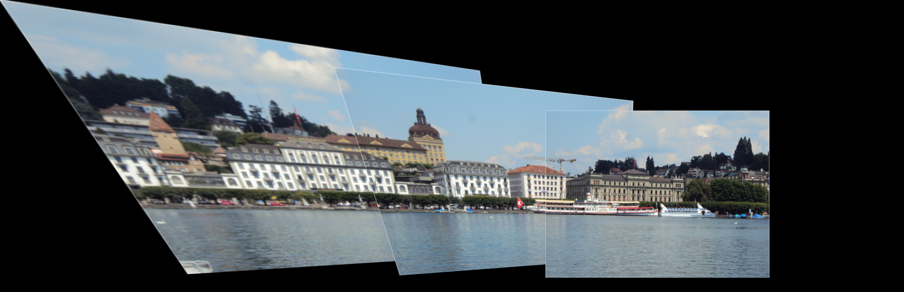

# Panorama Image Stitching
This repository implements two approaches for panorama image stitching. The first is traditional method of image stitching using corner detection, Adaptive non-maximal suppression, feature descriptor, matching and RANSAC. The another is Deep Learning Approach where supervised and unsupervised approach is explored.(HomographyNet)

## Phase I Instructions


Input:
  
Output:


The path to the folder of images can be provided as mentioned below.
``python Wrapper.py --Folder $PATH_TO_DATA
``

## Phase II Instructions

- The ```Wrapper.py``` simply shows an example of generating a pair of images according to the Data Generation technique presented in the Supervised approach paper.
- To train the supervised model run ```python Train.py --ModelType=sup```
- To train the unsupervised model run ```python Train.py --ModelType=unsup```
- To test the supervised model run ```python Test.py --ModelType=sup``` after having trained it.
- To test the unsupervised model run ```python Test.py --ModelType=unsup``` after having trained it.
- All scripts assume that there is a ```Data``` folder, in which MS COCO images are stored according to the given filesystem scheme.
